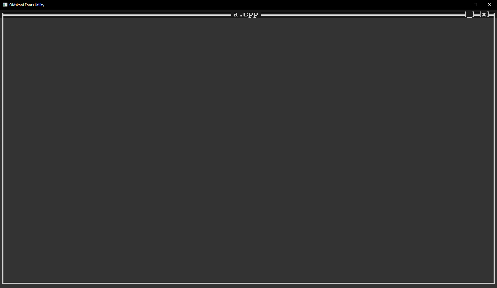

# retro-semigraphics
Text-mode user interface rendering engine in C++ and GLSL, using SDL3.

## Introduction

Welcome to my first GitHub repo!

Retro-semigraphics is envisaged as a rendering engine and GUI toolkit for creating modern text-mode-style applications.

My goals for this project revolve around learning C++ and shader coding, learning more about how source code turns into executable instructions, and understanding the interactions between an application and the host OS and underlying hardware. 

## What it is

Retro-semigraphics is at its core a 'terminal emulator', not in the normal sense, but in the sense that applications are built upon and rendered entirely out of fixed-size font glyphs in fixed positions on the screen, emulating the 'text-mode' graphics of early IBM-compatible PCs on contemporary desktop environments. Essentially, the worst of both worlds!

It's not much yet, but it's a start!

## What it does

Retro-semigraphics is built as a collection of a few distinct subsystems:

### GUI Elements

GUI elements are the individual objects comprising the GUI, such as buttons, checkboxes and radio button groups, text and password inputs, menus and menubars, scrollbars etc.

GUI element objects hold all defining data for the element (e.g. position, size, colours, text strings, etc.) and are responsible for implementing their own rendering functions. 

Common interface classes for GUI elements are defined in `rsg-component.hpp`.

### GUI Engine

The GUI engine `rsg-gui-engine.cpp` is responsible for keeping track of the various GUI elements in our design, and for allowing elements to be added, configured, and removed from the design.

The GUI engine also co-ordinates the 'painting' of GUI elements on each render pass, iterating through elements and calling their `Repaint()` routines to generate the next frame of character data before transfer to the GPU. 

#### Further development 

1. The engine may be responsible for delegating app events to appropriate user routines (e.g. button pressed), this may alternatively be implemented directly in each GUI element. I'm not clued up enough yet to know how it'll look.

2. It is envisaged that the GUI engine and/or GUI elements might also provide means to skip rendering characters that have not changed since the last render pass and have therefore already been rendered, avoiding wasted time re-rendering these every frame. 

    The `CharData` buffer is set up to retain characters between frames, but either the GUI manager or the elements themselves will need to keep track of characters needing updates, and possibly which element 'owns' (is the 'front-most' element at) each individual character in the window.

### SDL Engine

The SDL engine `rsg-sdl-engine.cpp` is responsible for setting up the GPU before rendering begins, and transferring character data to the GPU on each frame of the rendering cycle. This module makes all calls to the SDL3 libraries and serves as an interface between SDL3 and the GUI engine.

It's quite daunting to look at (even for me having written it), but it's really just a lot of boilerplate code for loading the shader code onto the GPU and setting up the appropriate buffers and GPU configuration to get our font texture and character data into the locations expected by our shaders.

### Text Shaders

The text shaders, `glyph2_v` and `glyph_f` are the vertex and fragment shaders used to render our GUI. 

Unlike many conventional shader designs, the vertex shader implemented here does not take in a vertex buffer. Instead, it is given access to a readonly buffer containing one entry per on-screen character. From this buffer, the shader itself generates the six verts (two tris) required to render each character, calculates and sets the vertex positions (`gl_Position`) for each of the verts, and calculates the appropriate UV co-ords for the glyphs comprising the current character, finally passing these to the fragment shader.

The fragment shader is far more conventional, running once per vertex and taking in the UV co-ords and colours for the current character. It samples the bitmap font texture for each glyph contained, tinting opaque pixels to the foreground colour and filling transparent pixels with the background colour. 

We've now filled our window with characters!

## Work in progress

For the first release version of this project, I'm aiming to implement the following features:

- SDL Engine & Shaders
    - Using `CharData` input format ✔
    - Multiple Glyphs per character ✔
    - Multiple colours per character `TODO`
- GUI manager
    - Add Elements ✔
    - Render Elements ✔
    - InitWithWindow ✔
    - GUI Events `WIP`
        - Keyboard Events
        - Mouse Events
- GUI Elements
    - Window ✔
    - Button `WIP`
    - Canvas `?`
    - Scrollbar `TODO`
    - Text Box, Text Area `TODO`
    - Checkbox `TODO`
    - Radio Button, Radio Group `TODO`
    - Menu Bar, Menu Item `TODO`

## Disclaimer

This code is free for anyone to use, share, distribute, modify, copy, cut, paste, whatever you want in line with the GPL license; however, I don't suggest using this code as a base for any of your own projects - at least not in its current form.

I'm only a novice myself and my primary motivation here is to learn, I most likely won't be able to provide any meaningful support if you run into any issues.

I'd instead suggest at most using this repo as a source of examples to supplement the articles, tutorials, and examples mentioned in `app_main.c` and in the 'References' section below. 

## Future plans

As is the style of these times, I'm also working on designing my own computer architecture, and my hopes are for the outcomes of this project to lead back into that design. I'll add a link in to that project in the future, but the basic idea is for a 16 bit data/24 bit address CPU, vaguely comparable to the 68k, for building a retro/tracker-style music production battlestation. Idk how far I'll get but I hope to at least build an emulator in C++, and I'm really hoping to eventually build a hardware version using one or more FPGAs.

## Thanks and References

Special thanks goes to the following wonderful people for creating and sharing the repos and articles that have guided and continue to guide me through this project. I really can't recommend reading their material enough.

### Sam Lantiga
- `hello.c` example code, a great template for SDL3 projects.
- `testgpu_spinning_cube.c`

### Hamdy Elzanqali
- Article titled "Let there be triangles, SDL_gpu edition"

### Evan Hemsley 
 - Article titled "SDL GPU API Concepts: Sprite Batcher"
 - Article titled "SDL GPU API Concepts: Data Transfer and Cycling" 
 - Github repo "SDL_gpu_examples" (so many helpful examples)

 ### Joey de Vries
 - Article titled "Rendering Sprites"

 ### Vulcain Plop 
 - Article titled "Sprite Batching with SDL3_gpu for Efficient Rendering"

 ### Loïc Chen 
 - Github repo "sdl3-gpu-experiments"

 ### Snorri Sturluson 
 - Github repo "vulkan-sprites" - the shaders in this repo were invaluable to me, thank you so much